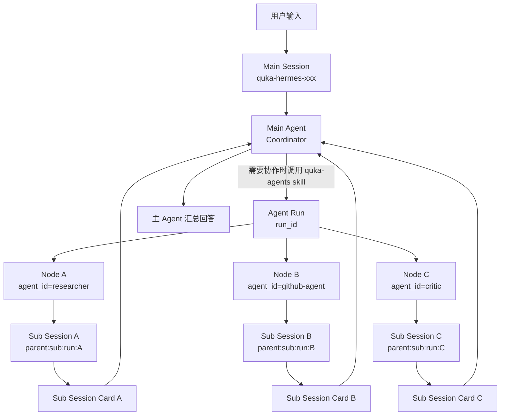
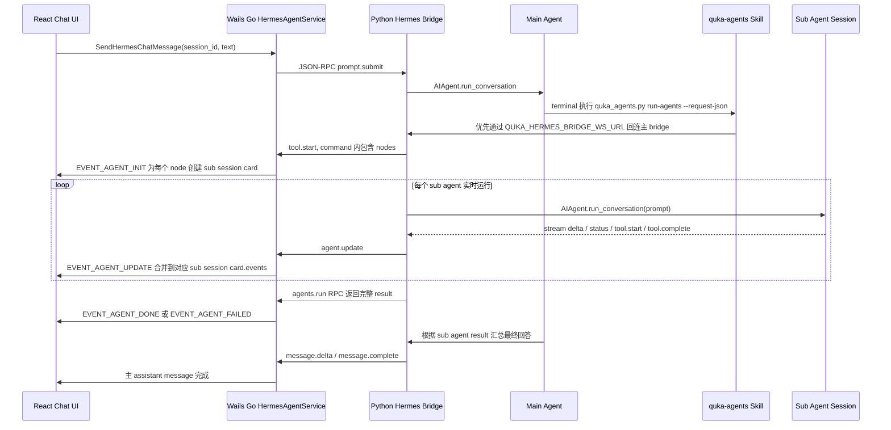
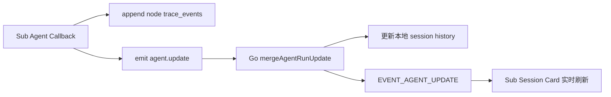
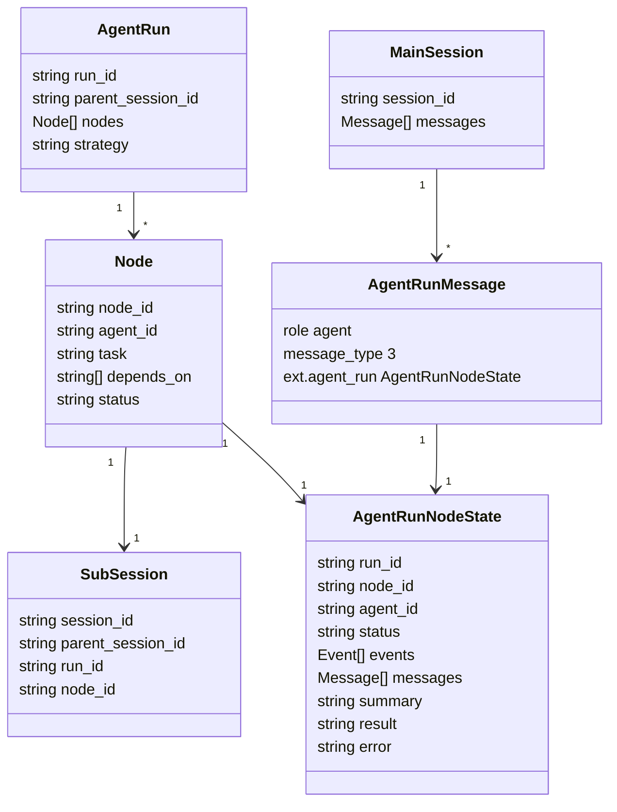
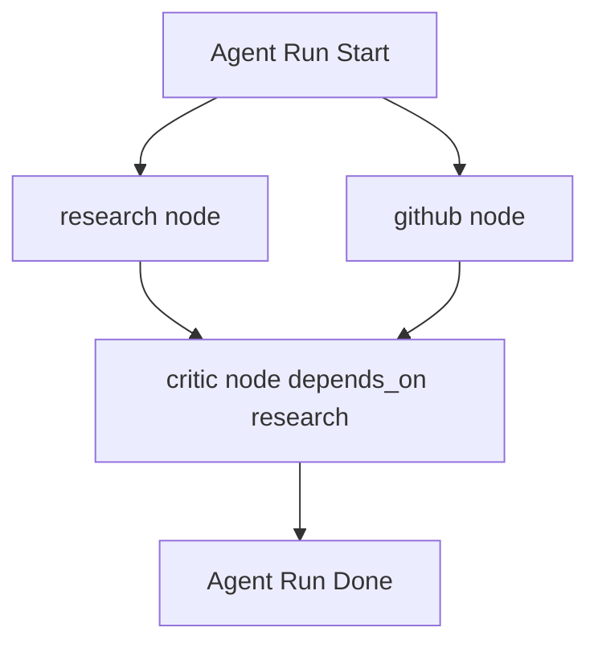

# Hermes Session 与 Sub Session 关系说明

本文说明 QukaAI Desktop 在客户端模式下集成 Hermes Agent 后，主聊天 session、sub agent、sub session card 与实时事件流之间的关系。

## 核心对象

| 对象 | 所属层 | 说明 |
| --- | --- | --- |
| Main Session | QukaAI Desktop / Hermes Bridge | 用户当前正在聊天的主会话，对应 `quka-hermes-<id>`。主 agent 在这个 session 中接收用户输入、决定是否委派 sub agent，并最终汇总回复用户。 |
| Main Agent | Hermes Runtime | 当前主 session 中的 Hermes `AIAgent` 实例。它拥有完整对话历史，并作为 coordinator 使用 `quka-agents` skill 发起多 agent 协作。 |
| Agent Run | Hermes Bridge | 一次多 agent 协作运行，对应一个 `run_id`。一次 run 可以包含 N 个 node，每个 node 会生成一张 sub session card。 |
| Node | Hermes Bridge | 一个被委派的 sub agent 任务单元，包含 `node_id`、`agent_id`、`task`、`depends_on`、`toolsets` 等。 |
| Sub Session | Hermes Runtime | 每个 node 内部独立运行的 Hermes agent session，`session_id` 形如 `<parent_session_id>:sub:<run_id>:<node_id>`。 |
| Sub Session Card | React Chat UI | 前端消息列表里的 `role=agent` 卡片，用于展示某个 sub session 的运行状态、流式输出、tool activity、summary 和最终 result。 |

## 总体关系

## 执行时序

## 为什么 sub agent 不再作为普通 tool call 展示

`quka-agents` 仍然由主 agent 通过 terminal tool 发起，这是 Hermes 当前最自然的 skill 调用方式。但在 QukaAI Desktop UI 中，它不应该显示为普通 tool call，原因是：

- 一次 `quka-agents` 调用可能包含 N 个并行 node。
- 每个 node 都是一个独立 sub session，而不是一次简单工具调用。
- 用户需要看到每个 sub agent 的独立状态、实时输出和 tool activity。
- 主 agent 的最终总结应该出现在所有 sub session card 之后。

因此 Go 层会拦截 `quka_agents.py run-agents` 对应的 `tool.start/tool.complete`，不生成普通 tool message，而是生成 `role=agent` 的 sub session card。

## 实时同步机制

实时同步分为两段：

1. Python bridge 内部运行 sub agent 时，sub agent 的 callback 会把以下事件追加到 node trace：
   - `delta`
   - `status`
   - `tool.start`
   - `tool.complete`

2. 同一个 callback 会立即发出 `agent.update` JSON-RPC event。Go 收到后会：
   - 根据 `run_id + node_id` 找到对应 card。
   - 如果主 agent 没显式传 `run_id`，用 cached quka-agents tool id 映射回初始化 card 使用的 id。
   - 将新事件 append 到 `agent_run.events`。
   - 通过 `EVENT_AGENT_UPDATE` 推给前端。

## 数据结构关系

## 持久化模型

主 session 的聊天记录仍然存储在 QukaAI Desktop 的本地 session store 中。sub session card 是主 session history 的一类消息：

- `Meta.Role = 5`
- `Meta.MessageType = 3`
- `Meta.Complete = 0` 表示 running
- `Meta.Complete = 1` 表示 completed
- `Meta.Complete = 4` 表示 failed
- `Ext.AgentRun` 保存 sub session card 的全部状态

运行中收到 `agent.update` 时，Go 会更新内存 history，并向前端推送。创建和完成时会保存 store，确保重新加载 session 后仍能看到 sub session card 及其详情。

## 并行与 DAG

`Agent Run` 支持两类调度：

- `parallel`：互不依赖的 node 可以并行启动。
- `dag`：node 通过 `depends_on` 表达依赖，只有依赖完成后才启动。

UI 不关心调度策略，只关心每个 node 的状态事件。因此并行启动 N 个 sub agent 时，前端会看到 N 张 card 各自实时更新。

## 关键设计约束

- Sub agent 不继承完整主 session 历史。主 agent 必须在 node task 中写清楚目标、必要背景、输入摘要、期望输出和边界。
- Sub session 的输出不直接回复用户。它只作为 evidence/result 返回给主 agent，由主 agent 汇总最终答复。
- Sub session card 必须展示真实 node，不创建 synthetic coordinator placeholder。
- `quka-agents` 必须优先使用 `--request-json`，这样 Go 能在 `tool.start` 时立即解析 nodes 并创建 N 张 card。
- Python `--run-agents` 优先通过 `QUKA_HERMES_BRIDGE_WS_URL` 回连主 bridge，避免另起 bridge 子进程导致实时事件无法进入 UI。
- Bridge event sink 必须支持多 websocket 连接广播，否则临时 RPC 连接会覆盖 Wails Go 的 UI 连接，造成事件丢失。

## 故障排查

| 现象 | 常见原因 | 检查点 |
| --- | --- | --- |
| 只有最终 summary，没有实时过程 | sub agent 在独立子 bridge 中运行 | 检查 `QUKA_HERMES_BRIDGE_WS_URL` 是否注入到 Hermes runtime 环境。 |
| 出现普通 terminal tool call，而不是 sub session card | Go 没识别 quka-agents 命令 | 检查命令是否包含 `quka_agents.py` 和 `run-agents`。 |
| card 初始化后 update 生成了另一张 card | `run_id` 映射不一致 | 检查主 agent 是否传了显式 `run_id`；若未传，Go 应使用 cached tool id 映射。 |
| 前端看不到完整 tool activity | card 详情被折叠或事件没有进入 `agent_run.events` | running 状态应自动展开；检查 `EVENT_AGENT_UPDATE` payload。 |
| 重新加载 session 后详情缺失 | `Ext.AgentRun` 未写入本地 store | 检查 `recordAgentMessage` 是否保存了完整 `agent_run`。 |

